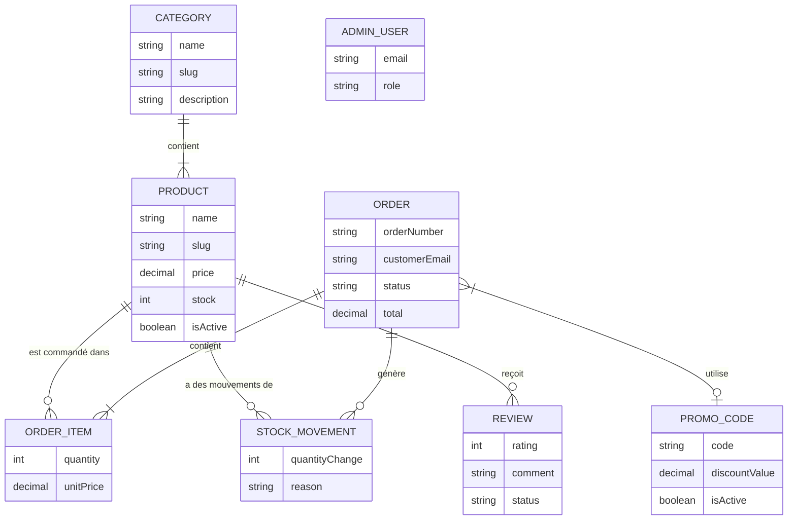
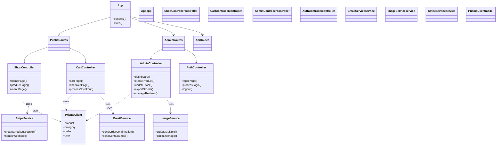

# Technical Design - InviThé Gourmand

## 1. Diagramme de Cas d'Utilisation (UML)

**Rôle :** Analyser le besoin.
**Acteurs :**
- **Visiteur/Client** : Consulte le site, commande, contacte.
- **Administrateur** : Gère le catalogue, les commandes, les stocks, etc.

```mermaid
graph TD
    %% Custom styles
    classDef actorStyle fill:#e1f5fe,stroke:#01579b,stroke-width:2px,color:#01579b;
    classDef adminStyle fill:#fff3e0,stroke:#e65100,stroke-width:2px,color:#e65100;
    classDef ucStyle fill:#ffffff,stroke:#333333,stroke-width:1px,rx:10,ry:10;

    subgraph "Front-Office (Visiteur)"
        direction TB
        V[Visiteur]:::actorStyle
        V -->|Consulter| UC1([Voir Accueil/Menu/Boutique]):::ucStyle
        V -->|Consulter| UC2([Voir Détail Produit]):::ucStyle
        V -->|Action| UC3([Ajouter au Panier]):::ucStyle
        V -->|Action| UC4([Passer Commande]):::ucStyle
        V -->|Action| UC5([Envoyer Message Contact]):::ucStyle
        V -->|Action| UC6([Laisser un Avis]):::ucStyle
    end

    subgraph "Back-Office (Admin)"
        direction TB
        A[Administrateur]:::adminStyle
        A -->|Auth| UC7([Login / Logout]):::ucStyle
        A -->|Gestion| UC8([Gérer Produits]):::ucStyle
        A -->|Gestion| UC9([Gérer Catégories]):::ucStyle
        A -->|Gestion| UC10([Gérer Commandes & Export]):::ucStyle
        A -->|Gestion| UC11([Gérer Stocks]):::ucStyle
        A -->|Gestion| UC12([Gérer Codes Promo]):::ucStyle
        A -->|Gestion| UC13([Modérer Avis]):::ucStyle
        A -->|Visualiser| UC14([Dashboard Stats]):::ucStyle
    end
```

## 2. MCD (Modèle Conceptuel de Données) - Merise

**Rôle :** Structurer la base de données.
**Description :** Met en évidence les entités et relations.

## 3. MLD (Modèle Logique de Données) - Merise

**Rôle :** Montrer les tables SQL finales.
**Description :** Précise les clés primaires (PK) et clés étrangères (FK).

## 4. Diagramme de Classes (UML)

**Rôle :** Architecture Code Back-end.
**Description :** Montre comment le code est organisé (Controllers, Services, Models/Prisma).

